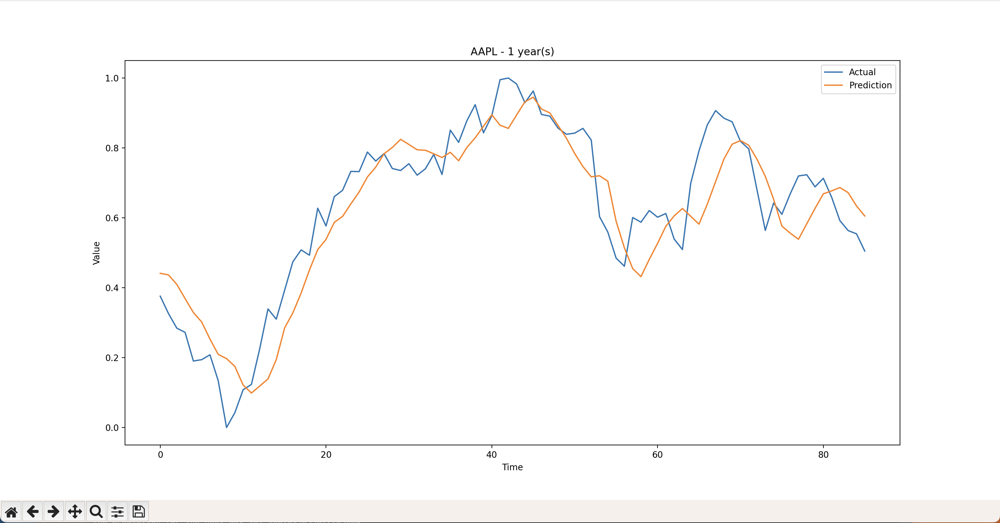

# TradeCrew
 This project, developed last year, aimed to assist in stock analysis for managing personal investment portfolios, including Tax-Free Savings Accounts (TFSA) and non-registered accounts. It provided features for portfolio management, stock analysis, risk assessment, performance metrics, and data visualization.

> [!NOTE]
> Project is initially abandoned as I found Job for Summer, not sure if I will maintain this project (maybe from time to time).
 
> [!WARNING]
> DO NOT USE THE TRADING STRATEGY AS YOUR PERSONAL STRATEGY.

## Setting Up Environment
1. This project is developed using PyCharm, the `.idea` Folder is included for virtual environment. It is recommended to use Jet Brain product to open this.
2. You can also install the `requirements.txt` on your global interpreter by using `pip install -r requirements.txt`.
3. If you only want to use certain script from this project, you can refer to the `requirements.txt` to install the requirements you need.
    ```text
    #Stock class, Tickers, Indivual Scripts, (Part) AnalysisScripts
    numpy
    pandas
    yfinance
    tqdm
    
    #Trading Stra, PricePred
    matplotlib
    pandas_ta
    backtesting
    tensorflow
    #Legacy
    sklearn
    #Present
    scikit-learn
    ```
4. Enable to support `match` case, make sure to use python version above 3.10.
    ```
    python --version
    ```

## Structure
The project includes 4 parts, AnalysisScripts, IndividualScripts, Stock, Tickers, and TradingStra.

* ### AnalysisScripts
  * CorrelationFiner
  <br/> Precondition: `NYSE` folder must be populated with `Downloader` and `Extractor`.
  <br/> This script is used to find stocks with similar correlation with input `stock exchange` (for example NYSE), then displays it, options including `POS: Postively related stocks`, `NEG: Negatively related stocks`, `NEU: Non-related stocks`.
  <br/><br/>Usage:
    ```python
    from AnalysisScripts.CorrelationFinder import corrFinder
    from Stock.Stock import Stock
    
    AAPL = Stock("AAPL")
    corrFinder(AAPL, dir='Data') #Relative Path for .csv downloaded
    ```
    Output:
    ```commandline
    Input the Stock Exchange: nyse
    Please input the type correlation looking for: Pos, Neu, Neg. (Type all 3 to display all types) Pos, Neu, Neg
    Please input if you want to save to a save: Y/N n
    Positive Correlated Stocks:[]
    Failed to save
    Neural Correlated Stocks:['SMI', 'GIM', 'GOL', 'ETP', 'CBI', 'CCZ', 'SIR', 'VVC', 'KS', 'SFE', 'MTS', 'NORD', 'CBA', 'PYT', 'CVG', 'RRTS', 'SEAS', 'JBK', 'TRMR']
    Failed to save
    Negative Correlated Stocks:['ZBK']
    Failed to save
    ```
  * DelayCorrelationFinder
  <br/> This script is used to find stocks with delayed correlations with given number of `days` and `stock exchange`, it will display the positively correlated stock with the number of days delayed.
  <br/><br/>Usage:
    ```python
    from AnalysisScripts.DelayCorrelationFinder import delayedCorrFinder
    from Stock.Stock import Stock

    QQQ = Stock("QQQ")
    delayedCorrFinder(QQQ, dir='Data')
    ```
    Output:
    ```commandline
    Input the Stock Exchange: nyse
    Input the number of days you want to perform the delayed analysis: 20
    Please input if you want to save to a save: Y/N n
    Day 0:[]
    Day 1:['MTS']
    Day 2:[]
    Day 3:[]
    Day 4:[]
    Day 5:[]
    Day 6:[]
    Day 7:[]
    Day 8:[]
    Day 9:[]
    Day 10:[]
    Day 11:[]
    Day 12:[]
    Day 13:[]
    Day 14:[]
    Day 15:[]
    Day 16:[]
    Day 17:[]
    Day 18:[]
    Day 19:[]
    Day 20:[]
    ```
  * PricePrediction
  <br/>This script is used to predict the stock price of the next day using machine learning... (To be continue)
  <br/><br/>Usage:
    ```python
    from Stock.Stock import Stock
    from AnalysisScripts.PricePred import pricePred
    
    AAPL = Stock("AAPL")
    pricePred(AAPL, 1)
    ```
    Output:
    ```commandline
    Epoch 30/30
    6/6 [==============================] - 0s 6ms/step - loss: 0.0103 - val_loss: 0.0106
    3/3 [==============================] - 0s 2ms/step
    1/1 [==============================] - 0s 8ms/step
    The prediction for the next day is: 186.31454467773438$
    ```
    Graph:
    
### IndividualScripts
Under this folder are indivual script which can run using Python:
`python *.py`
* Beta
  <br/>Calculate the market beta comparing with S&P 500, Dow Jones, and Nasdaq Index.
* CorrelationIndex
* CorrelationStocks
* Covariance
* Mean
* PatternMatchingIndex
* PercentageChangeD
* PercentageChangeY
* Variance

### Stock
* Stock Class
<br/> This is the main class to store a Stock's information, it has attributes `self.ticker, self.data, self.pct`.
<br/><br/> Functions of this class in include: 
<br/> `mean()`: calculate the median of the stock
<br/> `var()`: calculate the variance of a stock
<br/> `std()`: calculate the standard deviation of a stock
<br/> `cov(another_stock)`: calculate the covariance of a stock with another stock
<br/> `cor(another_stock)`: calculate the correlation of a stock with another stock
<br/> `beta()`: calculate the beta of a stock with comparison for ^GSPC(S&P 500), ^DJI(Dow Jones Index), ^IXIC(Nasdaq Index).
<br/> `negativeCorrelationFinder()`: Not implemented
<br/> `postiveCorrelationFinder()`: Not implemented
<br/> `neutrualCorrelationFinder()`: Not implemented
<br/><br/> Usage:
  ```python
  from Stock.Stock import Stock
  
  AAPL = Stock("AAPL")
  print(AAPL.data)
  print(AAPL.data['Adj Close'].pct_change())
  ```

### Tickers
* Downloader
<br/> This is the downloader class, which contains one function - `downloadData(tickeer,FolderName)`. This will take *tickers* and download its data to *FolderName*.
<br/><br/> Usage:
  ```python
  from Downloader import downloadData
  
  tickers = ['AAPL']
  downloadData(tickers,"NYSE")
  ```
* Extractor
<br/> This is the extractor class, which contains one function - `extractTickers(file)`. This will take the .csv file and extract all the tickers column.
<br/><br/> Usage:
  ```python
  from Extractor import extractTickers
  
  file = "NYSE.csv"
  tickers = extractTickers(file)
  ```
* .CSV Files
<br/> Some of the .csv files are given in the project folder, for example FTSE.csv, Nasdaq.csv, NYSE.csv etc. Users can also download these ticker csv files from online. (make sure to change column name to `Ticker`)
### TradingStra
  * Hedge
  * RSI Long

### TODOS:
- [x] Fix venv Python 3.10+
- [ ] Finish readme.md
- [ ] Add more trading Strategy
- [ ] Finish correlation finders